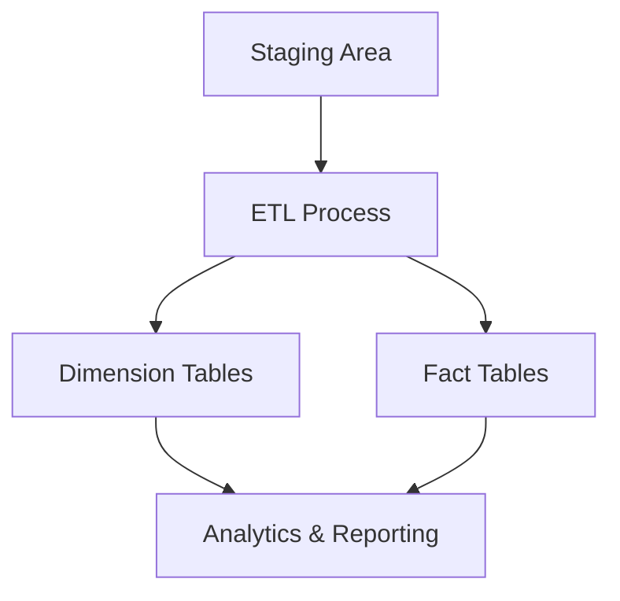
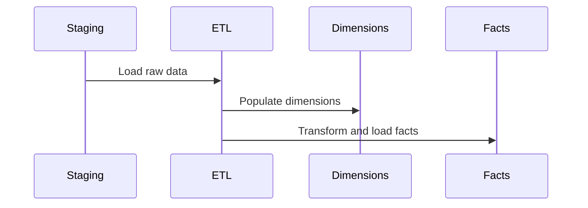

# Kimball Data Warehouse Technical Documentation

## Architecture Overview



## Dimension Tables

### 1. DimCustomer
- **Purpose**: Track customer information with SCD Type 2
- **Key Fields**:
  - `customer_key`: Surrogate key
  - `customer_id`: Business key
  - `country`: Customer location
  - SCD Type 2 fields: `valid_from`, `valid_to`, `is_current`

### 2. DimDate
- **Purpose**: Time-based analysis
- **Key Fields**:
  - `date_key`: YYYYMMDD format
  - `date`: Actual date
  - Temporal attributes: `year`, `quarter`, `month`, `day_of_week`, etc.

### 3. DimDataQuality
- **Purpose**: Track data quality issues
- **Key Fields**:
  - `issue_type`: e.g., NEGATIVE_QUANTITY, ZERO_PRICE
  - `severity`: HIGH, MEDIUM, LOW
  - `action_taken`: How issue was handled

## Fact Table

### FactSales
- **Purpose**: Store sales transactions
- **Key Fields**:
  - `sales_key`: Surrogate key
  - `invoice_number`: Business key
  - Measures: `quantity`, `unit_price`, `total_amount`
  - Foreign Keys: `customer_key`, `date_key`, `data_quality_key`

## ETL Process



### Key Steps:
1. **Staging**: Load raw data into staging tables
2. **Dimension Loading**:
   - Create SCD Type 2 records
   - Handle unknown/missing values
3. **Fact Loading**:
   - Apply business rules
   - Handle data quality issues
   - Maintain referential integrity

## Business Questions Answered

### Sales Analysis
- Quarterly sales trends
- Daily sales patterns
- Weekend vs weekday performance

### Customer Analysis
- Top performing countries
- Customer segmentation
- Average spend per customer

### Data Quality
- Issue distribution by type
- Impact by country
- Historical quality trends

## Usage

To generate a PDF from this documentation:
```bash
pandoc technical_documentation.md -o technical_documentation.pdf
```
